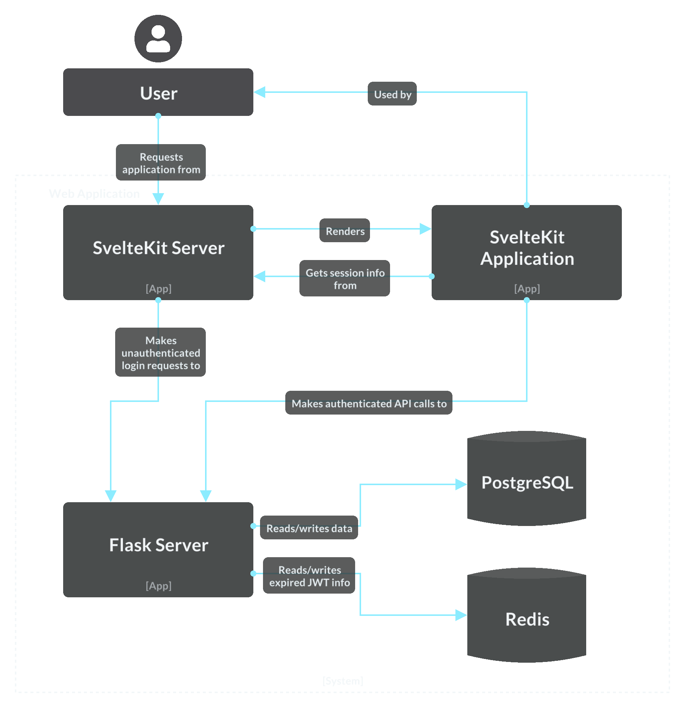

# Architecture

> C4 models are my passion (ignore the fact that this image is C1).

You _really_ shouldn't need more than that, but if you're still confused let's go through it.

- **SvelteKit Server**

This is what is made when you run `npm run dev` in `/client`: a SvelteKit server starts up. The old days of plain HTML and JS files are gone, and now you need a JavaScript server to compile and render a superset of HTML and JS server side and then serve it to your web browser through another HTTP server. The web is dead, long live the web.

We're also using this as a proxy for making login requests to the back-end (more on this in the next document).

- **SvelteKit Application**

This is what the SvelteKit server renders and serves to the users' web browser. The user interacts with this and does all their fun stuff through it.

- **Flask Server**

This is the back-end or API server, the real meat of every application and is created with `python3 main.py` in `/server`. We access our **PostgreSQL** database from here and do _things_ do that data.

We also need **Redis** to store session info, though technically we're actually storing expired session info (this is also in the next document).
